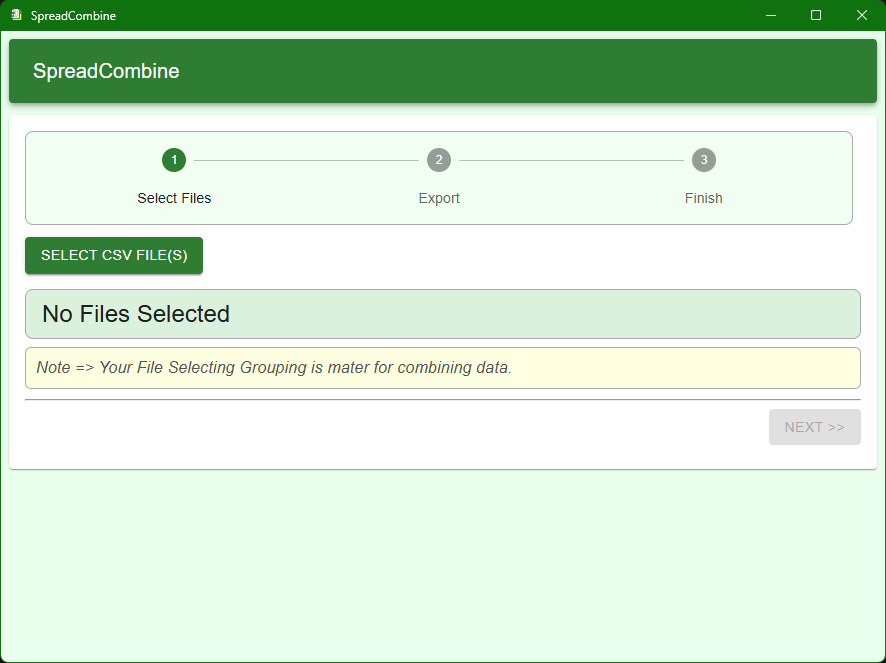
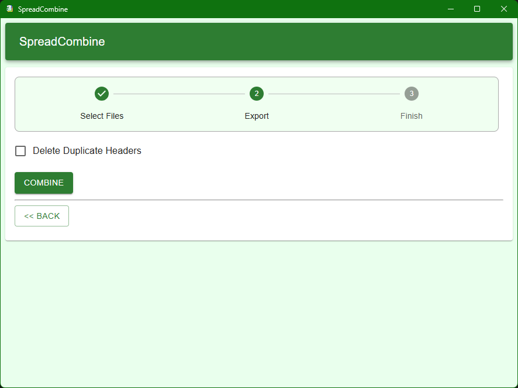
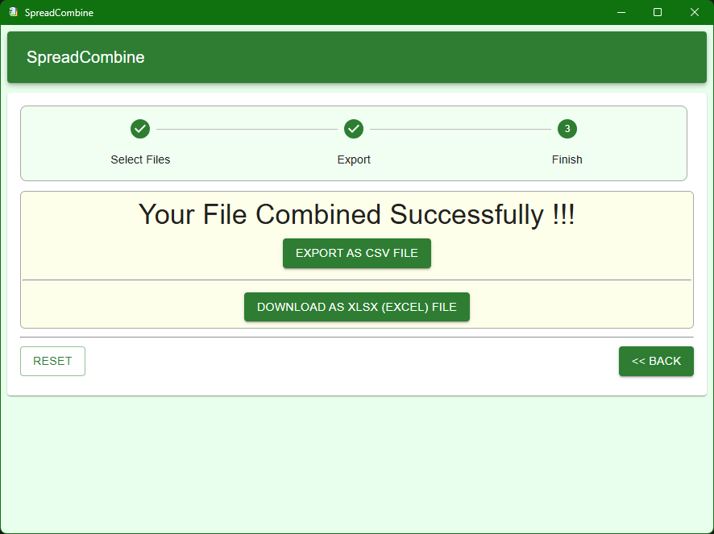

# Spreadcombine

A Cross-Platform Desktop app to combine multiple CSV files into a single CSV / XLSX File 


## Screenshots
#### Screenshot 1

#### Screenshot 2

#### Screenshot 2


# ***Go to release option to download***

## Project Setup

### Install

```bash
$ npm install
```

### Development

```bash
$ npm run dev
```

### Build

```powershell
# For windows
$env:CSC_LINK="./cert\NazzzInfotechCert.pfx"
$env:CSC_KEY_PASSWORD="1234"
npm run build:win
```

```bash
# For macOS
$ npm run build:mac

# For Linux
$ npm run build:linux
```
